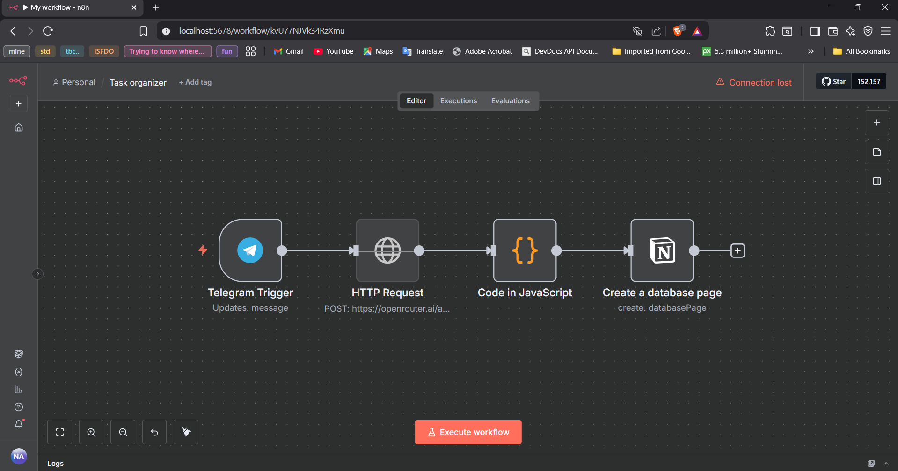
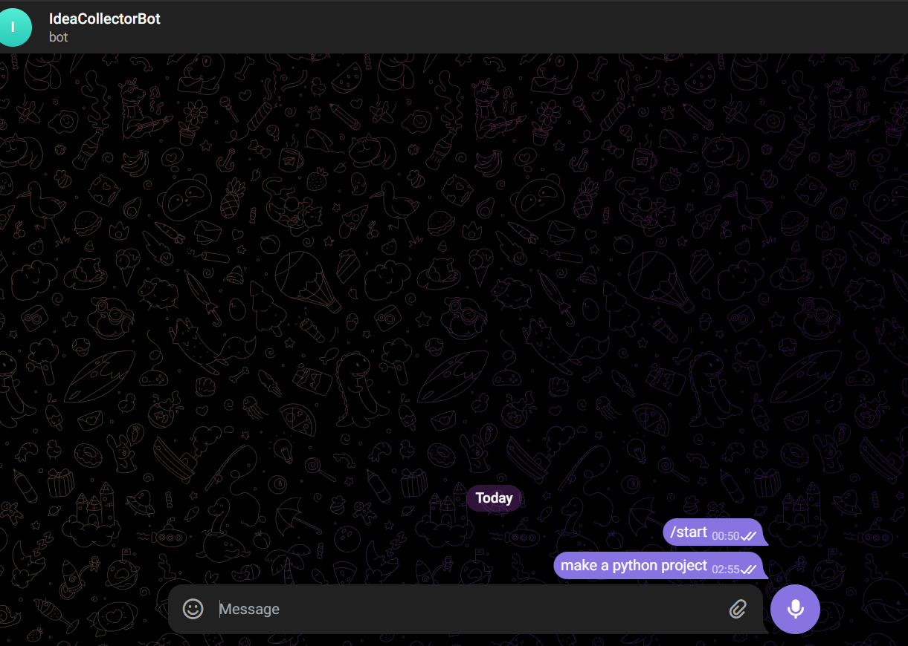
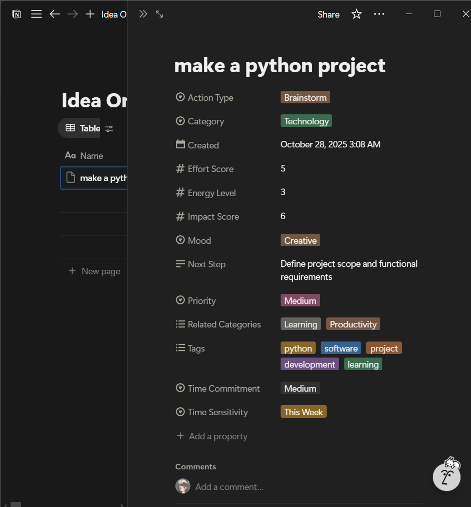

# 🌱 AI Idea Organizer Automation (n8n + Telegram + Notion + OpenAI)

## Overview  
This project was born out of a personal struggle — I often get random ideas at odd times and end up losing them.  
To fix that, I built an **automated system** that captures every idea I send to my **Telegram bot**, enriches it using **AI**, and neatly saves it into **Notion** for later reflection.  

It’s my way of turning scattered thoughts into organized creativity.  

## Features  
- **Quick Idea Capture:** Send thoughts instantly to your Telegram bot.  
- **AI Reflection:** OpenRouter’s GPT-OSS-20B gives your ideas context or suggestions.  
- **Automatic Logging:** Each idea and AI response is saved in Notion for later use.  
- **No Manual Effort:** All handled by an n8n workflow — visual, efficient, and reliable.  

## Tools & Technologies  
n8n · OpenRouter · OpenAI API · Notion API · Telegram Bot API · Docker  

## Custom Code Node
The workflow includes a JavaScript code node used to parse the AI response and format the data before sending it to Notion.  
You can find the script [here](./code-node.js).

## Screenshots  
### 🔸 n8n Workflow

### 🔸 Telegram Bot Interaction

### 🔸 Notion Idea Log

## How It Works  
1. Send an idea to your Telegram bot.  
2. n8n triggers and sends your message to **OpenRouter’s GPT-OSS-20B**.  
3. The AI processes and enhances your idea.  
4. Both the raw thought and AI insight are appended to **Notion** automatically.  
